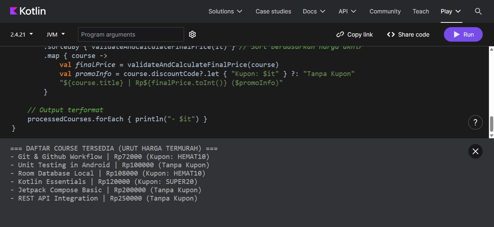

# Pemrograman Bergerak - Pertemuan 02

Tugas Pertemuan 2: Model Data Kotlin, Filter/Sort, dan Validasi Input.

## Deskripsi Program
Program ini memodelkan data course interaktif menggunakan `data class` Kotlin, menangani penawaran diskon berbasis kode promo dengan menerapkan *null safety*, serta memproses daftar course menggunakan *collection pipeline* (`filter`, `sortedBy`, `map`, dan `forEach`).

## Bukti Jalannya Program

## Catatan Pengerjaan
Bagian tersulit dari pengerjaan tugas ini adalah mengelola properti nullable pada pemrosesan diskon tanpa menggunakan operator `!!` agar kode tetap aman dari NullPointerException. Hal ini diselesaikan dengan memanfaatkan Safe Call (`?.`), Elvis Operator (`?:`), serta fungsi `let` untuk memformat tampilan teks promo secara kondisional. Selain itu, urutan pipeline collection disusun sedemikian rupa agar proses filtering ketersediaan data dilakukan lebih dulu sebelum perhitungan harga dan pengurutan (sorting).
